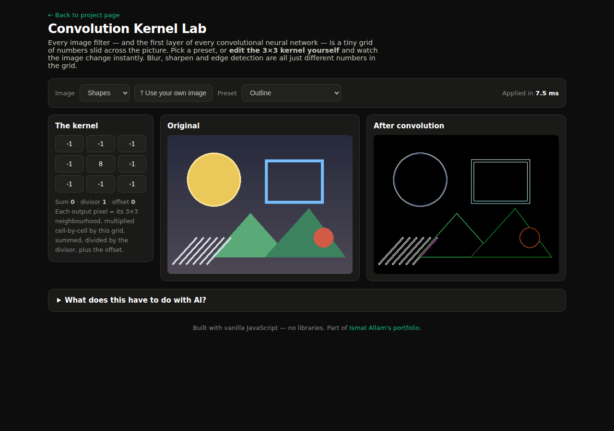

# Convolution Kernel Lab

Blur, sharpen, emboss and edge detection are the same operation with
different numbers. This lab lets you **edit the numbers**: a live 3×3
convolution playground in vanilla JavaScript — the intuition behind a CNN's
first layer, made touchable.

**[▶ Try it live](https://ismat-spec.github.io/projects/kernels/)**

## What it does

- Nine classic presets: identity, box blur, Gaussian blur, sharpen,
  Laplacian edge detect, Sobel (both directions), emboss, outline.
- Every kernel cell is **editable** — type a number and the image reapplies
  instantly, with the kernel's sum, divisor and offset always shown.
- Two built-in sample images with strong geometry, plus **use your own
  image** — processed entirely in your browser via the FileReader API,
  nothing is uploaded anywhere.
- A timer shows the real cost of each pass (~5 ms for a 480px-wide image).

## The interesting engineering

- The convolution is a single hand-written pass over the canvas's raw
  `ImageData` buffer with precomputed neighbour offsets. A first version
  using tidy helper functions took >100 ms per frame; flattening the loop
  brought it to ~5 ms — a 20× lesson in why data layout matters.
- Custom kernels auto-normalise by their sum so home-made blurs keep their
  brightness; edge kernels (sum 0) naturally cancel flat regions to black —
  which is the point the lab exists to teach.

## Run locally

Open `index.html` in a browser. That's it.
